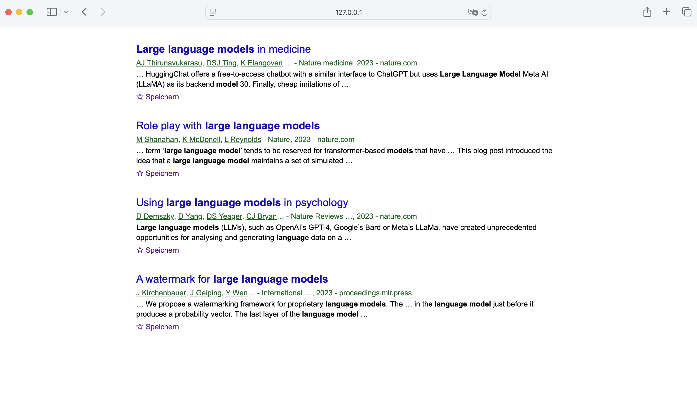

# CSS Arena – Task 1: Google Scholar

## Task

Create a CSS file `styles.css` that includes all the necessary rules to replicate the appearance of an article list **exactly** as shown in the provided screenshot (`ziel.png`).

> ⚠️ The HTML file `index.html` is **predefined** and must **not** be modified!

### Requirements:

- Pay attention to:
  - Fonts and font sizes
  - Colors (e.g., link color, citation count)
  - Spacing between elements
  - Formatting of the author line and source information
  - Styling of buttons like "Save" and author names

### Reference:

Good luck! 💪
